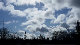
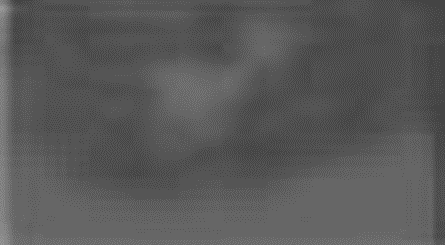

# Scenery-Video-GANs
This GAN takes an image (80x45px) and outputs a small gif of the size. This network is trained with data from Flickr. Inspirations: "Generating Videos with Scene Dynamics" and "Progressive Growing of GANs"
This particular neural network takes an image as input and generates a short video that animates the original image.
The network size is 80x46, and a Generative Adversarial Network is used, trained on Flickr videos collected from the web. 
The training data is a set of around 4000 videos (after processing) mostly related to sea and bodies of water.

